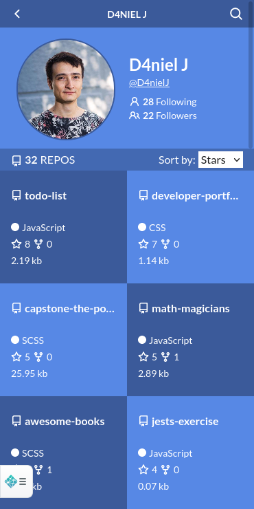

# Github Repros

Repros is a project that connects with the official GitHub API and allows the user to search himself or others with a proper Github Username.

> Search yourself or others and find relevant information about your repos.
> Click on the titles to be redirected to the oficial GitHub pages.

This is the capstone project for the React-Redux modules.

All of the actions made by the user are handle by reducers and update internal and universal states of the app.

## Live demo

* [Live Demo Here](https://ghrepros.netlify.app/)

## Documentation of the Project

* Follow [this link to Loom](https://www.loom.com/share/21ca7fec4cb443a2bafaf870162e0426) to watch a short video presentation of my project.

## Preview

## Learning objectives

- Use React documentation.
- Use React components.
- Use React props.
- Use React Router.
- Connect React and Redux.
- Handle events in a React app.
- Write integration tests with a React testing library.
- Use styles in a React app.
- Use React life cycle methods.
- Apply React best practices and language style guides in code.
- Use store, actions and reducers in React.

## Create React App

This project was bootstrapped with [Create React App](https://github.com/facebook/create-react-app).

## Run in local machine following these steps.

> 1. clone repo to your local machine
> 2. cd to the directory
> 3. create a .env.local file

set a local enviroment variable to:

REACT_APP_PTOKEN=`<replace with your token>`

Get your token from your profile in github > settings > developer settings!

## Available Scripts

In the project directory, you can run:

### `npm start`

Runs the app in the development mode.\
Open [http://localhost:3000](http://localhost:3000) to view it in the browser.

The page will reload if you make edits.\
You will also see any lint errors in the console.

### `npm test`

Launches the test runner in the interactive watch mode.\
See the section about [running tests](https://facebook.github.io/create-react-app/docs/running-tests) for more information.

### `npm run build`

Builds the app for production to the `build` folder.\
It correctly bundles React in production mode and optimizes the build for the best performance.

The build is minified and the filenames include the hashes.\
Your app is ready to be deployed!

See the section about [deployment](https://facebook.github.io/create-react-app/docs/deployment) for more information.

### `npm run eject`

**Note: this is a one-way operation. Once you `eject`, you can’t go back!**

## Authors

👤 _Daniel Jaramillo_

- GitHub: [@D4nielJ](https://github.com/d4nielj)

## 🤝 Contributing

Contributions, issues, and feature requests are welcome!

## Show your support

Give a ⭐️ if you like this project!

## 📝 License

This project is [MIT](./MIT.md) licensed.
